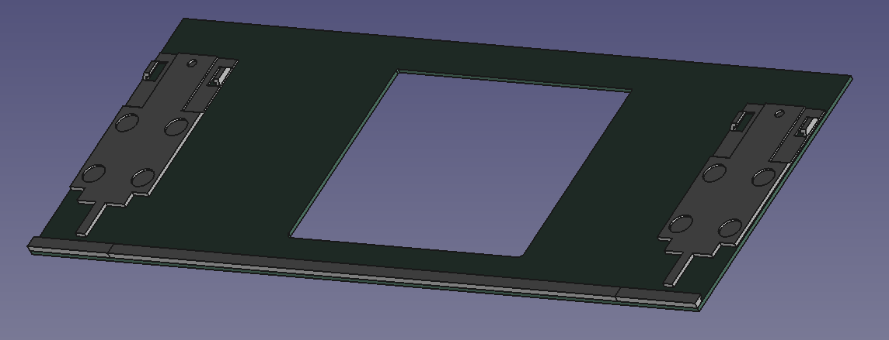

# Touchpad Input Module parts

This repository contains parts related to the Touchpad Input Module for
the Framework 16 laptop.  The top surface of the touchpad area modules
is 0.8mm, thus one of the items here is a PCB layout for a 0.8mm PCB
in the exact shape of the touchpad top surface, which can be modified
with your own preferred cutout (or no cutout at all).

This respository also contains 3d printable parts for the back rail
of the touchpad and touchpad area spacers, and for the latch assembly
at the front of touchpad area input modules.

## License
The contents of this repository are © 2024 by
C. Scott Ananian and is also licensed under CC BY 4.0.

To view a copy of this license,
visit http://creativecommons.org/licenses/by/4.0/

## Assembly and Fabrication

**THIS DESIGN HAS NOT YET BEEN TESTED. CAVEAT LECTOR.**

The idea is to have JLCPCB (or your preferred board house) fabricate
the top surface as a 0.8mm PCB.  You then glue the appropriate rail
parts to the "front" edge of the PCB, and carefully align and glue
the latch parts to leave a 2.9mm gap between the bump in the center
of the rail and the corresponding projection on the latch piece.

The latch piece has a cutout for a 3mm x 1.5mm disc magnet, to secure
itself to a matching magnet in the FW 16 midplate.  It also contains
cutouts for 8mm x 1.5mm rubber bumpers, which take the place of some
rubberized material in the middle section of the Framework-fabricated
touchpad area modules.
