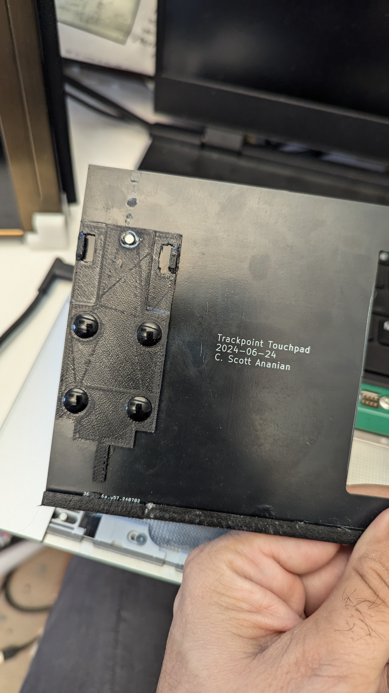

# Touchpad Input Module parts

This repository contains parts related to the Touchpad Input Module for
the Framework 16 laptop.  The top surface of the touchpad area modules
is 0.8mm, thus one of the items here is a PCB layout for a 0.8mm PCB
in the exact shape of the touchpad top surface, which can be modified
with your own preferred cutout (or no cutout at all).

This respository also contains 3d printable parts for the back rail
of the touchpad and touchpad area spacers, and for the latch assembly
at the front of touchpad area input modules.

## License
The contents of this repository are © 2024 by
C. Scott Ananian and is also licensed under CC BY 4.0.

To view a copy of this license,
visit http://creativecommons.org/licenses/by/4.0/

## Assembly and Fabrication

Have JLCPCB (or your preferred board house) fabricate
the top surface as a 0.8mm PCB.  There are two designs here
for that: in `ThinkpadClickpad` you'll find a "normal width"
touchpad module with a cutout for a Thinkpad T470S touchpad.
This is part of a project to make a "touchpad with buttons"
for the FW16.  To complete a "normal width" touchpad,
you'll need two latch pieces, two side rail pieces, and
one "long side rail" piece.

In `FullWidthBlank` you can find a PCB that is the full width
of the FW16 deck, for those who want a seamless touchpad area
with no need for the Framework spacers (or their gaps, or their
silver color).  To complete a "full width" touchpad,
you'll need two latch pieces, two "medium" side rail pieces,
and one "long side rail" piece.  (You could also use *four* latch
pieces, but that's probably overkill.)

In any case, you glue the appropriate rail parts to the "front" edge
of the PCB, with the "long" rail in the center, and carefully align
and glue the latch parts to leave a 2.9mm gap between the bump in the
center of the rail and the corresponding projection on the latch
piece.

I find it easiest to glue the rail parts, then slide the latch pieces
onto the FW16 midplate, put glue on the top, then slide the top plate
on top and press down to set the glue.  That ensures that the latches
get aligned properly.

The latch piece has a cutout for a 3mm x 1.5mm disc magnet, to secure
itself to a matching magnet in the FW 16 midplate.  It also contains
cutouts for 8mm x 1.5mm rubber bumpers, which take the place of some
rubberized material in the middle section of the Framework-fabricated
touchpad area modules.

For the 'full width blank' you will need a dummy PCB to tell the
FW16 that a touchpad is installed (though it is not).  You can find
the necessary PCB in https://github.com/cscott/DummyTouchpadFW16

You are encouraged to customize the top plate!  If you want to preserve
the stock Framework Touchpad, you can start with either the full width
blank or the clickpad blank and replace the opening with an appropriate
one for the FW16 touchpad.  You're responsible for removing the touchpad
from your stock unit, transferring it over, and mounting it correctly;
sorry I'm not interested in that so I haven't figured out the details,
but patches to this repo are welcome if you've figured it out and want
to share.

Regardless, you can tweak the artwork.  I've done different artwork on
both sides to allow a choice.  I used black soldermask and laid out
the design as copper underneath the soldermask, which gives a subtle
texture.  If you want something more obvious, there are additional
"colors" available: anything you put on the silkscreen layer will be
rendered in white.  If you put anything on the "soldermask" layer the
soldermask will be *removed* in that area.  That means you'll get
either pale yellow (bare PCB) if there is not copper in that area, or
silver/gold if there is copper underneath.  Please note that by
default PCBs any exposed copper will be "tinned" with a solder
containing lead in order to make it easy to mount components.  Since
this is going to be something that sits under your palms all day, I
would strongly recommend avoiding lead.  You can either (a) have no
exposed copper, thus no lead solder; (b) choose a "lead free" surface
finish, for a slight additional cost and a silver color to your exposed
copper; or (c) choose "ENIG" surface finish, for a larger additional
cost but a pretty gold color on your exposed copper layer.
